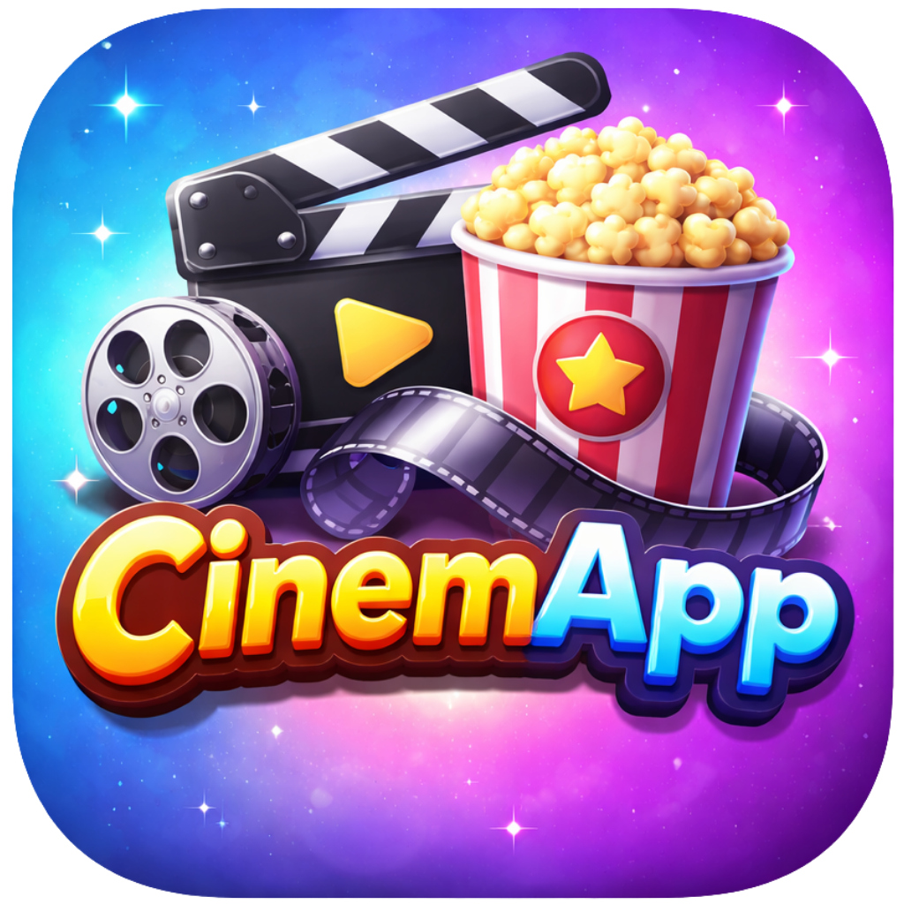

# 🎬 CinemApp



**CinemApp** es una aplicación moderna y elegante para explorar el mundo del cine. Construida con **Flutter** y **Clean Architecture**, ofrece una experiencia de usuario fluida y visualmente impactante, integrando la potente API de TMDb.

---

## ✨ Características Principales

- **Selección Diaria Inteligente**: Algoritmo personalizado que sugiere 10 películas únicas cada día, asegurando que siempre tengas algo nuevo que ver.
- **Catálogo Extenso**: Explora miles de películas y actores con un scroll infinito y filtros avanzados.
- **Búsqueda Global**: Encuentra películas y personas al instante desde cualquier lugar de la app.
- **Detalles Inmersivos**:
  - Información completa de películas (sinopsis, reparto, equipo técnico).
  - Tráilers integrados con reproducción en la app (y fallback a YouTube).
  - Perfiles detallados de actores con su filmografía completa.
  - Recomendaciones personalizadas.
- **Gestión de Interacciones**: Marca películas como "Vistas" o ignóralas para refinar futuras recomendaciones (Integración con Supabase).
- **Diseño Responsivo**: Experiencia optimizada para Móviles, Tablets y Escritorio (Web/Linux).
- **Localización**: Interfaz y contenido completamente en Español (es-ES).

---

## 🛠️ Tecnologías Empleadas

Este proyecto demuestra el uso de prácticas de ingeniería de software de alto nivel:

- **Framework**: [Flutter](https://flutter.dev/) (Soporte Multiplataforma).
- **Arquitectura**: Clean Architecture (Domain, Data, Presentation).
- **Gestión de Estado**: [Flutter Riverpod](https://riverpod.dev/).
- **Navegación**: [GoRouter](https://pub.dev/packages/go_router).
- **Base de Datos**: [Supabase](https://supabase.com/) (PostgreSQL) para persistencia de interacciones.
- **API Externa**: [The Movie Database (TMDb)](https://www.themoviedb.org/).
- **UI/UX**: Material 3, Animaciones, Diseño Adaptativo.

---

## 🚀 Instalación y Configuración

Sigue estos pasos para ejecutar el proyecto en tu entorno local:

### Prerrequisitos

- Flutter SDK (Stable Channel).
- Una clave de API de **TMDb**.
- Una cuenta y proyecto en **Supabase**.

### Pasos

1.  **Clonar el repositorio**:

    ```bash
    git clone https://github.com/tu-usuario/cinemapp.git
    cd cinemapp
    ```

2.  **Instalar dependencias**:

    ```bash
    flutter pub get
    ```

3.  **Configurar Variables de Entorno**:
    Crea un archivo `.env` en la raíz del proyecto con el siguiente contenido:

    ```env
    TMDB_API_KEY=tu_api_key_de_tmdb
    TMDB_BASE_URL=https://api.themoviedb.org/3
    SUPABASE_URL=tu_url_de_supabase
    SUPABASE_ANON_KEY=tu_clave_anon_de_supabase
    ```

4.  **Ejecutar la App**:
    - **Móvil (Android/iOS)**:
      ```bash
      flutter run
      ```
    - **Web**:
      ```bash
      flutter run -d chrome
      ```
    - **Escritorio (Linux/Windows/macOS)**:
      ```bash
      flutter run -d linux
      ```

---

## 🏗️ Arquitectura del Proyecto

El código está organizado siguiendo los principios de **Clean Architecture** para garantizar escalabilidad y mantenibilidad:

```
lib/
├── core/           # Utilidades, constantes y manejo de errores base.
├── data/           # Repositorios, Fuentes de Datos (API/DB) y Modelos.
├── domain/         # Entidades, Interfaces de Repositorios y Casos de Uso.
├── presentation/   # Widgets, Pages, Providers (Riverpod) y Estado UI.
└── assets/         # Recursos estáticos (Imágenes, Iconos).
```

---

## 📱 Capturas de Pantalla

|              Inicio               |               Detalles               |               Catálogo                |
| :-------------------------------: | :----------------------------------: | :-----------------------------------: |
| _(Inserta aquí captura del Home)_ | _(Inserta aquí captura de Detalles)_ | _(Inserta aquí captura del Catálogo)_ |

---

Creado con 💙 por Devian.
